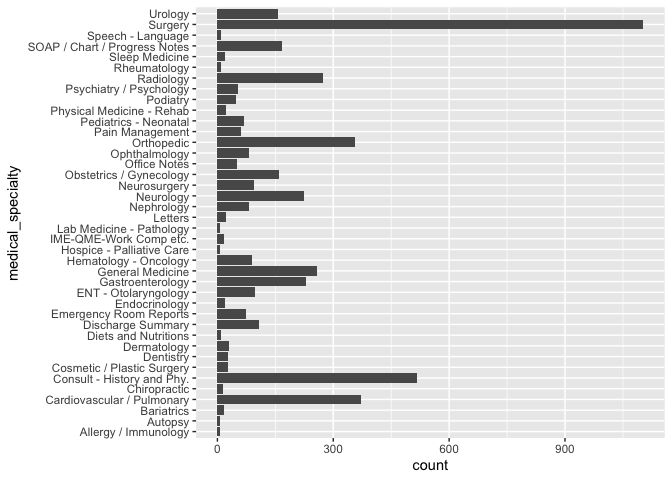
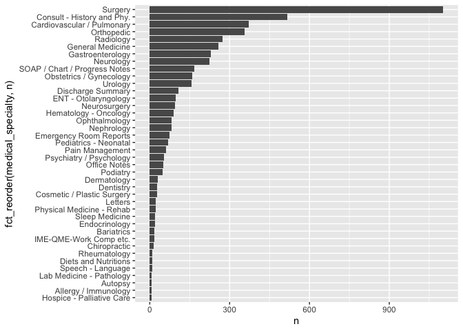
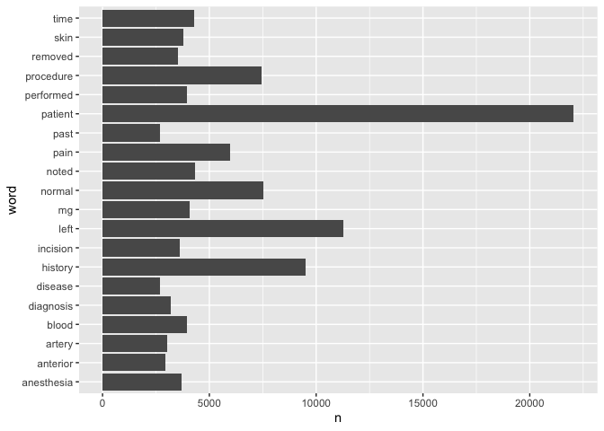

README
================
Xiaoyu Zhu
10/1/2021

## prepare the packages

``` r
library(tidyverse)
```

    ## ── Attaching packages ─────────────────────────────────────── tidyverse 1.3.1 ──

    ## ✓ ggplot2 3.3.5     ✓ purrr   0.3.4
    ## ✓ tibble  3.1.5     ✓ dplyr   1.0.7
    ## ✓ tidyr   1.1.3     ✓ stringr 1.4.0
    ## ✓ readr   2.0.1     ✓ forcats 0.5.1

    ## ── Conflicts ────────────────────────────────────────── tidyverse_conflicts() ──
    ## x dplyr::filter() masks stats::filter()
    ## x dplyr::lag()    masks stats::lag()

``` r
library(tidytext)
library(dplyr)
library(tibble)
library(knitr)
library(forcats)
```

## download the data

``` r
fn<-"matsamples.csv"
if (!file.exists(fn))
download.file("https://raw.githubusercontent.com/USCbiostats/data-science-data/master/00_mtsamples/mtsamples.csv",destfile=fn)

mtsamples<-read.csv(fn)
mtsamples<-as_tibble(mtsamples)
```

## Question 1: What specialties do we have?

### We can use count() from dplyr to figure out how many different catagories do we have? Are these catagories related? overlapping? evenly distributed?

``` r
specialties<-mtsamples%>%
count(medical_specialty)
# there are `r nrow(specialities)`specialty 


specialties%>%
  arrange(desc(n))%>%
  top_n(15)%>%
  knitr::kable()
```

    ## Selecting by n

| medical\_specialty            |    n |
|:------------------------------|-----:|
| Surgery                       | 1103 |
| Consult - History and Phy.    |  516 |
| Cardiovascular / Pulmonary    |  372 |
| Orthopedic                    |  355 |
| Radiology                     |  273 |
| General Medicine              |  259 |
| Gastroenterology              |  230 |
| Neurology                     |  223 |
| SOAP / Chart / Progress Notes |  166 |
| Obstetrics / Gynecology       |  160 |
| Urology                       |  158 |
| Discharge Summary             |  108 |
| ENT - Otolaryngology          |   98 |
| Neurosurgery                  |   94 |
| Hematology - Oncology         |   90 |

``` r
# method1
ggplot(mtsamples,aes(x=medical_specialty))+
  geom_histogram(stat = "count")+
  coord_flip()
```

    ## Warning: Ignoring unknown parameters: binwidth, bins, pad

<!-- -->

``` r
# method2
ggplot(specialties,aes(x=n,y=fct_reorder(medical_specialty,n)))+
  geom_col()
```

<!-- -->

## Question 2

### Tokenize the the words in the transcription column

### Count the number of times each token appears

### Visualize the top 20 most frequent words

``` r
mtsamples%>%
  unnest_tokens(output = word, input=transcription)%>%
  count(word,sort= T)%>%
  top_n(20)%>%
  ggplot(aes(x=n,y=fct_reorder(word,n)))+
  geom_col()
```

    ## Selecting by n

<!-- -->

## Question 3

### Redo visualization but remove stopwords before

``` r
# Remove Stop Words
transcription_20_sw <- 
  mtsamples %>%
  unnest_tokens(output = word, input = transcription) %>%
  count(word, sort = TRUE) %>%
  anti_join(stop_words, by = "word") %>%
  top_n(20)
```

    ## Selecting by n

``` r
transcription_20_sw %>%
  knitr::kable()
```

<<<<<<< HEAD
| word       |     n |
|:-----------|------:|
| patient    | 22065 |
| left       | 11258 |
| history    |  9509 |
| 2          |  8864 |
| 1          |  8396 |
| normal     |  7526 |
| procedure  |  7463 |
| 3          |  6093 |
| pain       |  5976 |
| 4          |  5318 |
| 0          |  4765 |
| 5          |  4427 |
| noted      |  4348 |
| time       |  4287 |
| mg         |  4087 |
| blood      |  3956 |
| performed  |  3953 |
| skin       |  3798 |
| anesthesia |  3707 |
| incision   |  3601 |

``` r
# Remove stop Words AND numbers
transcription2 <- 
  mtsamples %>%
  unnest_tokens(output = word, input = transcription) %>%
  count(word, sort = TRUE) %>%
  anti_join(stop_words, by = "word") %>%
  filter(!grepl(pattern = "^[0-9]+$", x = word)) %>%
  top_n(20)
```

    ## Selecting by n

``` r
transcription2 %>%
  knitr::kable()
```

| word       |     n |
|:-----------|------:|
| patient    | 22065 |
| left       | 11258 |
| history    |  9509 |
| normal     |  7526 |
| procedure  |  7463 |
| pain       |  5976 |
| noted      |  4348 |
| time       |  4287 |
| mg         |  4087 |
| blood      |  3956 |
| performed  |  3953 |
| skin       |  3798 |
| anesthesia |  3707 |
| incision   |  3601 |
| removed    |  3532 |
| diagnosis  |  3212 |
| artery     |  3027 |
| anterior   |  2932 |
| disease    |  2682 |
| past       |  2674 |

``` r
# Visualize the top 20 without the stop words AND numbers
ggplot(transcription2, aes(x = word, y = n)) +
  geom_bar(stat = "identity") +
  coord_flip()
```

<!-- -->

## Question 4

### repeat question 2, but this time tokenize into bi-grams. how does the result change if you look at tri-grams?

``` r
mtsamples%>%
  unnest_tokens(output = word, input=transcription)%>%
  count(word,sort= T)%>%
  top_n(20)%>%
  ggplot(aes(x=n,y=fct_reorder(word,n)))+
  geom_col()
```

    ## Selecting by n

<!-- -->

## Question 5

### Using the results you got from questions 4. Pick a word and count the words that appears after and before it.

### Let’s take a look at the word “patient” since it shows up frequently.

``` r
# Create a tri-gram and separate into 3 columns
# Also remove stop words & numbers
# Before
mtsamples %>%
  unnest_ngrams(ngram, transcription, n = 3) %>%
  separate(ngram, into = c("before", "word", "after"), sep = " ") %>%
  select(before, word, after) %>%
  filter(word == "patient") %>%
  count(before, sort = TRUE) %>%
  anti_join(stop_words, by = c("before" = "word")) %>%
  filter(!grepl(pattern = "^[0-9]+$", x = before)) %>%
  top_n(20) %>%
  knitr::kable()
```

    ## Selecting by n

| before       |   n |
|:-------------|----:|
| history      | 101 |
| procedure    |  32 |
| female       |  26 |
| sample       |  23 |
| male         |  22 |
| illness      |  16 |
| plan         |  16 |
| indications  |  15 |
| allergies    |  14 |
| correct      |  11 |
| detail       |  11 |
| normal       |  10 |
| exam         |   9 |
| lbs          |   9 |
| instructions |   8 |
| minutes      |   8 |
| recommend    |   8 |
| systems      |   8 |
| day          |   7 |
| digits       |   7 |
| subjective   |   7 |

``` r
# After
# Before
mtsamples %>%
  unnest_ngrams(ngram, transcription, n = 3) %>%
  separate(ngram, into = c("before", "word", "after"), sep = " ") %>%
  select(before, word, after) %>%
  filter(word == "patient") %>%
  count(after, sort = TRUE) %>%
  anti_join(stop_words, by = c("after" = "word")) %>%
  filter(!grepl(pattern = "^[0-9]+$", x = after)) %>%
  top_n(20) %>%
  knitr::kable()
```

    ## Selecting by n

| after        |   n |
|:-------------|----:|
| tolerated    | 994 |
| denies       | 552 |
| underwent    | 180 |
| received     | 160 |
| reports      | 155 |
| understood   | 113 |
| lives        |  81 |
| admits       |  69 |
| appears      |  68 |
| including    |  67 |
| denied       |  62 |
| reported     |  58 |
| remained     |  56 |
| understands  |  51 |
| subsequently |  49 |
| stated       |  46 |
| continued    |  38 |
| returned     |  38 |
| agreed       |  36 |
| continues    |  35 |

``` r
# After
# Before
mtsamples %>%
  unnest_ngrams(ngram, transcription, n = 3) %>%
  separate(ngram, into = c("before", "word", "after"), sep = " ") %>%
  select(before, word, after) %>%
  filter(word == "patient") %>%
  count(after, sort = TRUE) %>%
  anti_join(stop_words, by = c("after" = "word")) %>%
  filter(!grepl(pattern = "^[0-9]+$", x = after)) %>%
  top_n(20) %>%
  knitr::kable()
```

    ## Selecting by n

| after        |   n |
|:-------------|----:|
| tolerated    | 994 |
| denies       | 552 |
| underwent    | 180 |
| received     | 160 |
| reports      | 155 |
| understood   | 113 |
| lives        |  81 |
| admits       |  69 |
| appears      |  68 |
| including    |  67 |
| denied       |  62 |
| reported     |  58 |
| remained     |  56 |
| understands  |  51 |
| subsequently |  49 |
| stated       |  46 |
| continued    |  38 |
| returned     |  38 |
| agreed       |  36 |
| continues    |  35 |

## Question 6

### Which words are most used in each of the specialties. you can use group\_by() and top\_n() from dplyr to have the calculations be done within each specialty. Remember to remove stopwords. How about the most 5 used words?

``` r
mtsamples %>%
  unnest_tokens(word, input = transcription) %>%
  group_by(medical_specialty) %>%
  count(word, sort = TRUE) %>%
  anti_join(stop_words, by = "word") %>%
  filter(!grepl(pattern = "^[0-9]+$", x = word)) %>%
  top_n(5) %>%
  arrange(medical_specialty, desc(n)) %>%
  knitr::kable()
```
=======

You can also embed plots, for example:
>>>>>>> b673af3cc880ea5fda6ea980ae5b4bf73ac17026

    ## Selecting by n

| medical\_specialty            | word         |    n |
|:------------------------------|:-------------|-----:|
| Allergy / Immunology          | history      |   38 |
| Allergy / Immunology          | noted        |   23 |
| Allergy / Immunology          | patient      |   22 |
| Allergy / Immunology          | allergies    |   21 |
| Allergy / Immunology          | nasal        |   13 |
| Allergy / Immunology          | past         |   13 |
| Autopsy                       | left         |   83 |
| Autopsy                       | inch         |   59 |
| Autopsy                       | neck         |   55 |
| Autopsy                       | anterior     |   47 |
| Autopsy                       | body         |   40 |
| Bariatrics                    | patient      |   62 |
| Bariatrics                    | history      |   50 |
| Bariatrics                    | weight       |   36 |
| Bariatrics                    | surgery      |   34 |
| Bariatrics                    | gastric      |   30 |
| Cardiovascular / Pulmonary    | left         | 1550 |
| Cardiovascular / Pulmonary    | patient      | 1516 |
| Cardiovascular / Pulmonary    | artery       | 1085 |
| Cardiovascular / Pulmonary    | coronary     |  681 |
| Cardiovascular / Pulmonary    | history      |  654 |
| Chiropractic                  | pain         |  187 |
| Chiropractic                  | patient      |   85 |
| Chiropractic                  | dr           |   66 |
| Chiropractic                  | history      |   56 |
| Chiropractic                  | left         |   54 |
| Consult - History and Phy.    | patient      | 3046 |
| Consult - History and Phy.    | history      | 2820 |
| Consult - History and Phy.    | normal       | 1368 |
| Consult - History and Phy.    | pain         | 1153 |
| Consult - History and Phy.    | mg           |  908 |
| Cosmetic / Plastic Surgery    | patient      |  116 |
| Cosmetic / Plastic Surgery    | procedure    |   98 |
| Cosmetic / Plastic Surgery    | breast       |   95 |
| Cosmetic / Plastic Surgery    | skin         |   88 |
| Cosmetic / Plastic Surgery    | incision     |   67 |
| Dentistry                     | patient      |  195 |
| Dentistry                     | tooth        |  108 |
| Dentistry                     | teeth        |  104 |
| Dentistry                     | left         |   94 |
| Dentistry                     | procedure    |   82 |
| Dermatology                   | patient      |  101 |
| Dermatology                   | skin         |  101 |
| Dermatology                   | cm           |   77 |
| Dermatology                   | left         |   58 |
| Dermatology                   | procedure    |   44 |
| Diets and Nutritions          | patient      |   43 |
| Diets and Nutritions          | weight       |   40 |
| Diets and Nutritions          | carbohydrate |   37 |
| Diets and Nutritions          | day          |   28 |
| Diets and Nutritions          | food         |   27 |
| Diets and Nutritions          | plan         |   27 |
| Discharge Summary             | patient      |  672 |
| Discharge Summary             | discharge    |  358 |
| Discharge Summary             | mg           |  301 |
| Discharge Summary             | history      |  208 |
| Discharge Summary             | hospital     |  183 |
| Emergency Room Reports        | patient      |  685 |
| Emergency Room Reports        | history      |  356 |
| Emergency Room Reports        | pain         |  273 |
| Emergency Room Reports        | normal       |  255 |
| Emergency Room Reports        | denies       |  149 |
| Endocrinology                 | thyroid      |  129 |
| Endocrinology                 | patient      |  121 |
| Endocrinology                 | left         |   63 |
| Endocrinology                 | history      |   57 |
| Endocrinology                 | dissection   |   45 |
| Endocrinology                 | gland        |   45 |
| Endocrinology                 | nerve        |   45 |
| ENT - Otolaryngology          | patient      |  415 |
| ENT - Otolaryngology          | nasal        |  281 |
| ENT - Otolaryngology          | left         |  219 |
| ENT - Otolaryngology          | ear          |  182 |
| ENT - Otolaryngology          | procedure    |  181 |
| Gastroenterology              | patient      |  872 |
| Gastroenterology              | procedure    |  470 |
| Gastroenterology              | history      |  341 |
| Gastroenterology              | normal       |  328 |
| Gastroenterology              | colon        |  240 |
| General Medicine              | patient      | 1356 |
| General Medicine              | history      | 1027 |
| General Medicine              | normal       |  717 |
| General Medicine              | pain         |  567 |
| General Medicine              | mg           |  503 |
| Hematology - Oncology         | patient      |  316 |
| Hematology - Oncology         | history      |  290 |
| Hematology - Oncology         | left         |  187 |
| Hematology - Oncology         | mg           |  107 |
| Hematology - Oncology         | mass         |   97 |
| Hospice - Palliative Care     | patient      |   43 |
| Hospice - Palliative Care     | mg           |   28 |
| Hospice - Palliative Care     | history      |   27 |
| Hospice - Palliative Care     | daughter     |   22 |
| Hospice - Palliative Care     | family       |   19 |
| Hospice - Palliative Care     | pain         |   19 |
| IME-QME-Work Comp etc.        | pain         |  152 |
| IME-QME-Work Comp etc.        | patient      |  106 |
| IME-QME-Work Comp etc.        | dr           |   82 |
| IME-QME-Work Comp etc.        | injury       |   81 |
| IME-QME-Work Comp etc.        | left         |   70 |
| Lab Medicine - Pathology      | cm           |   35 |
| Lab Medicine - Pathology      | tumor        |   35 |
| Lab Medicine - Pathology      | lymph        |   30 |
| Lab Medicine - Pathology      | lobe         |   29 |
| Lab Medicine - Pathology      | upper        |   20 |
| Letters                       | pain         |   80 |
| Letters                       | abc          |   71 |
| Letters                       | patient      |   65 |
| Letters                       | normal       |   53 |
| Letters                       | dr           |   46 |
| Nephrology                    | patient      |  348 |
| Nephrology                    | renal        |  257 |
| Nephrology                    | history      |  160 |
| Nephrology                    | kidney       |  144 |
| Nephrology                    | left         |  132 |
| Neurology                     | left         |  672 |
| Neurology                     | patient      |  648 |
| Neurology                     | normal       |  485 |
| Neurology                     | history      |  429 |
| Neurology                     | time         |  278 |
| Neurosurgery                  | patient      |  374 |
| Neurosurgery                  | c5           |  289 |
| Neurosurgery                  | c6           |  266 |
| Neurosurgery                  | procedure    |  247 |
| Neurosurgery                  | left         |  222 |
| Obstetrics / Gynecology       | patient      |  628 |
| Obstetrics / Gynecology       | uterus       |  317 |
| Obstetrics / Gynecology       | procedure    |  301 |
| Obstetrics / Gynecology       | incision     |  293 |
| Obstetrics / Gynecology       | normal       |  276 |
| Office Notes                  | normal       |  230 |
| Office Notes                  | negative     |  193 |
| Office Notes                  | patient      |   94 |
| Office Notes                  | history      |   76 |
| Office Notes                  | noted        |   60 |
| Ophthalmology                 | eye          |  456 |
| Ophthalmology                 | patient      |  258 |
| Ophthalmology                 | procedure    |  176 |
| Ophthalmology                 | anterior     |  150 |
| Ophthalmology                 | chamber      |  149 |
| Orthopedic                    | patient      | 1711 |
| Orthopedic                    | left         |  998 |
| Orthopedic                    | pain         |  763 |
| Orthopedic                    | procedure    |  669 |
| Orthopedic                    | lateral      |  472 |
| Pain Management               | patient      |  236 |
| Pain Management               | procedure    |  197 |
| Pain Management               | needle       |  156 |
| Pain Management               | injected     |   76 |
| Pain Management               | pain         |   76 |
| Pediatrics - Neonatal         | patient      |  247 |
| Pediatrics - Neonatal         | history      |  235 |
| Pediatrics - Neonatal         | normal       |  155 |
| Pediatrics - Neonatal         | child        |   82 |
| Pediatrics - Neonatal         | mom          |   82 |
| Physical Medicine - Rehab     | patient      |  220 |
| Physical Medicine - Rehab     | left         |  104 |
| Physical Medicine - Rehab     | pain         |   95 |
| Physical Medicine - Rehab     | motor        |   62 |
| Physical Medicine - Rehab     | history      |   54 |
| Podiatry                      | foot         |  232 |
| Podiatry                      | patient      |  231 |
| Podiatry                      | left         |  137 |
| Podiatry                      | tendon       |   98 |
| Podiatry                      | incision     |   96 |
| Psychiatry / Psychology       | patient      |  532 |
| Psychiatry / Psychology       | history      |  344 |
| Psychiatry / Psychology       | mg           |  183 |
| Psychiatry / Psychology       | mother       |  164 |
| Psychiatry / Psychology       | reported     |  141 |
| Radiology                     | left         |  701 |
| Radiology                     | normal       |  644 |
| Radiology                     | patient      |  304 |
| Radiology                     | exam         |  302 |
| Radiology                     | mild         |  242 |
| Rheumatology                  | history      |   50 |
| Rheumatology                  | patient      |   34 |
| Rheumatology                  | mg           |   26 |
| Rheumatology                  | pain         |   23 |
| Rheumatology                  | day          |   22 |
| Rheumatology                  | examination  |   22 |
| Rheumatology                  | joints       |   22 |
| Sleep Medicine                | sleep        |  143 |
| Sleep Medicine                | patient      |   69 |
| Sleep Medicine                | apnea        |   35 |
| Sleep Medicine                | activity     |   31 |
| Sleep Medicine                | stage        |   29 |
| SOAP / Chart / Progress Notes | patient      |  537 |
| SOAP / Chart / Progress Notes | mg           |  302 |
| SOAP / Chart / Progress Notes | history      |  254 |
| SOAP / Chart / Progress Notes | pain         |  239 |
| SOAP / Chart / Progress Notes | blood        |  194 |
| Speech - Language             | patient      |  105 |
| Speech - Language             | therapy      |   41 |
| Speech - Language             | speech       |   35 |
| Speech - Language             | patient’s    |   28 |
| Speech - Language             | evaluation   |   17 |
| Speech - Language             | goals        |   17 |
| Speech - Language             | term         |   17 |
| Speech - Language             | time         |   17 |
| Surgery                       | patient      | 4855 |
| Surgery                       | left         | 3263 |
| Surgery                       | procedure    | 3243 |
| Surgery                       | anesthesia   | 1687 |
| Surgery                       | incision     | 1641 |
| Urology                       | patient      |  776 |
| Urology                       | bladder      |  357 |
| Urology                       | procedure    |  306 |
| Urology                       | left         |  288 |
| Urology                       | history      |  196 |
