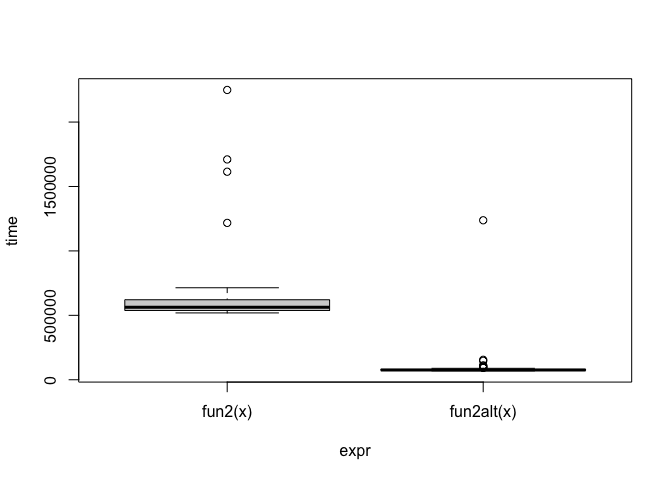

Lab 9 - HPC
================
Xiaoyu Zhu
10/29/2021

# Learning goals

### In this lab, you are expected to learn/put in practice the following skills:

Evaluate whether a problem can be parallelized or not. Practice with the
parallel package. Use Rscript to submit jobs Practice your skills with
Git.

## Problem 1: Think

Give yourself a few minutes to think about what you just learned. List
three examples of problems that you believe may be solved using parallel
computing, and check for packages on the HPC CRAN task view that may be
related to it.

## Problem 2: Before you

The following functions can be written to be more efficient without
using parallel: \#\#\# This function generates a n x k dataset with all
its entries distributed poission with mean lambda.

``` r
fun1 <- function(n = 100, k = 4, lambda = 4) {
  x <- NULL
  for (i in 1:n)
    x <- rbind(x, rpois(k, lambda))
  return(x)
}

fun1alt <- function(n = 100, k = 4, lambda = 4) {
  # YOUR CODE HERE
}

fun1(5,10)
```

    ##      [,1] [,2] [,3] [,4] [,5] [,6] [,7] [,8] [,9] [,10]
    ## [1,]    4    2    4    5    4    5    3    1    2     4
    ## [2,]    1    5    1    4    6    3    3    1    5     5
    ## [3,]   10    2    3   10    5    4    1    3    4     2
    ## [4,]    4    3    8    4    5    6    6    3    3     4
    ## [5,]    1    5    3    2    3    0    4    3    4     2

``` r
ans<-fun1(5000,10)

fun1alt <- function(n = 100, k = 4, lambda = 4) {
  matrix(rpois(n * k, lambda = lambda), ncol = k)
}


# Benchmarking
microbenchmark::microbenchmark(
  fun1(),
  fun1alt()
)
```

    ## Warning in microbenchmark::microbenchmark(fun1(), fun1alt()): less accurate
    ## nanosecond times to avoid potential integer overflows

    ## Unit: microseconds
    ##       expr     min      lq      mean   median       uq     max neval
    ##     fun1() 158.670 173.553 182.55906 183.1265 190.1990 209.592   100
    ##  fun1alt()  12.956  13.653  22.38559  14.3705  14.8625 802.493   100

### Find the column max (hint: Checkout the function max.col()).

``` r
# Data Generating Process (10 x 10,000 matrix)
set.seed(1234)
x <- matrix(rnorm(1e4), nrow=10)
# Find each column's max value
fun2 <- function(x) {
  apply(x, 2, max) # actually a for loop
}
fun2alt <- function(x) {
  # position of the max value per row of x.
  idx<-max.col(t(x))
  # Do something to get the actual max value
  # x[cbind(1,15)]~x[1,15]
  # want to access x[1,16], x[4,1]
  # x[rbind(c(1,16),c(4,1))]
  x[cbind(idx, 1:ncol(x))]
}

# Benchmarking
ans_benchmark <- microbenchmark::microbenchmark(
  fun2(x),
  fun2alt(x), unit = "relative"
)
plot(ans_benchmark)
```

<!-- --> \#\# Problem
3: Parallelize everything We will now turn our attention to
non-parametric bootstrapping. Among its many uses, non-parametric
bootstrapping allow us to obtain confidence intervals for parameter
estimates without relying on parametric assumptions.

The main assumption is that we can approximate many experiments by
resampling observations from our original dataset, which reflects the
population.

This function implements the non-parametric bootstrap:

``` r
library(parallel)
my_boot <- function(dat, stat, R, ncpus = 1L) {
  
  # Getting the random indices
  n <- nrow(dat)
  idx <- matrix(sample.int(n, n*R, TRUE), nrow=n, ncol=R)
 
  # Making the cluster using `ncpus`
  # STEP 1: Make cluster
  cl <- makePSOCKcluster(ncpus)
  # on.exit(stopCluster(cl))
  
  # STEP 2: Set it up (export data if needed), idx, dat
  clusterExport(cl, varlist = c("idx", "dat", "stat"), envir = environment())
  # clusterSetRNGStream(cl, 12312)
  # clusterEvalQ(cl, library(ggplot2))
  
  # STEP 3: THIS FUNCTION NEEDS TO BE REPLACES WITH parLapply
  ans <- parLapply(cl, seq_len(R), function(i) {
    stat(dat[idx[,i], , drop=FALSE])
  })
  
  # Coercing the list into a matrix
  ans <- do.call(rbind, ans)
  
  # STEP 4: stop the cluster
  stopCluster(cl)
  
  ans
  
}
```

``` r
# Bootstrap of an OLS
my_stat <- function(d) coef(lm(y ~ x, data=d))
# DATA SIM
set.seed(1)
n <- 500
R <- 1000
x <- cbind(rnorm(n))
y <- x*5 + rnorm(n)
# Checking if we get something similar as lm
ans0 <- confint(lm(y~x))
ans1 <- my_boot(
  dat   = data.frame(x, y),
  stat  = my_stat,
  R     = R,
  ncpus = 2L
  )
# You should get something like this
t(apply(ans1, 2, quantile, c(.025,.975)))
```

    ##                   2.5%      97.5%
    ## (Intercept) -0.1430703 0.05292241
    ## x            4.8685251 5.04843669

``` r
##                   2.5%      97.5%
## (Intercept) -0.1372435 0.05074397
## x            4.8680977 5.04539763
ans0
```

    ##                  2.5 %     97.5 %
    ## (Intercept) -0.1379033 0.04797344
    ## x            4.8650100 5.04883353

``` r
##                  2.5 %     97.5 %
## (Intercept) -0.1379033 0.04797344
## x            4.8650100 5.04883353
```


    Is it faster?

    ```r
    system.time(my_boot(dat = data.frame(x, y), my_stat, R = 4000, ncpus = 1L))

    ##    user  system elapsed 
    ##   0.036   0.004   1.323

``` r
system.time(my_boot(dat = data.frame(x, y), my_stat, R = 4000, ncpus = 2L))
```


    ##    user  system elapsed 
    ##   0.049   0.009   0.777
